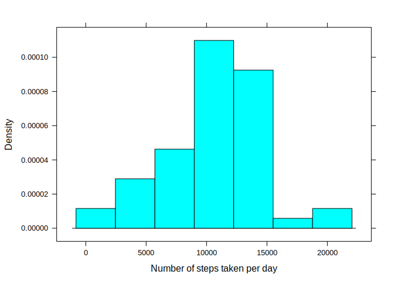
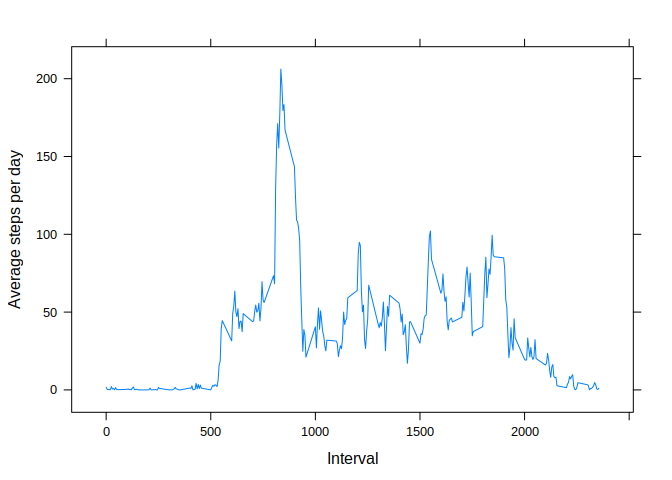
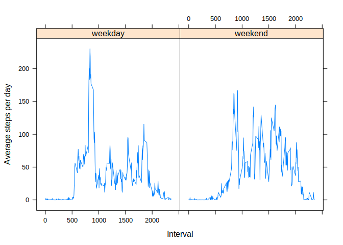

```r
library(data.table)
library(lattice)
```

## Loading and preprocessing the data

```r
activity <- data.table(read.csv("./activity.csv"))
activity$date <- as.Date(activity$date)
```

## What is mean total number of steps taken per day?

```r
## Calculate the total number of steps taken per day
steps_per_day <- activity[, .(steps_per_day = sum(steps)), by = "date"]
## Make a histogram of the total number of steps taken each day
histogram(data = steps_per_day, ~ steps_per_day, type = "density",
          xlab = "Number of steps taken per day", ylab = "Density")
```

<!-- -->

```r
## Calculate and report the mean and median of the total number of steps taken per day
cat("Mean steps per day: ", mean(steps_per_day$steps_per_day, na.rm = TRUE))
```

```
## Mean steps per day:  10766.19
```

```r
cat("Median steps per day: ", median(steps_per_day$steps_per_day, na.rm = TRUE))
```

```
## Median steps per day:  10765
```

### What is the average daily activity pattern?

```r
## Make a time series plot (i.e. \color{red}{\verb|type = "l"|}type="l") of the
## 5-minute interval (x-axis) and the average number of steps taken, averaged
## across all days (y-axis)
daily_activity <- activity[, .(steps_per_interval = mean(steps, na.rm = TRUE))
                         , by = "interval"]
xyplot(data = daily_activity,
       steps_per_interval ~ interval, type = "l",
       xlab = "Interval",
       ylab = "Average steps per day")
```

<!-- -->

```r
## Which 5-minute interval, on average across all the days in the dataset,
## contains the maximum number of steps?
cat("Maximum average number of steps is",
    daily_activity[which.max(daily_activity$steps_per_interval), ]$steps_per_interval,
    "in interval",
    daily_activity[which.max(daily_activity$steps_per_interval), ]$interval)
```

```
## Maximum average number of steps is 206.1698 in interval 835
```

### Imputing missing values

```r
## Calculate and report the total number of missing values in the dataset
## (i.e. the total number of rows with \color{red}{\verb|NA|}NAs)
cat(nrow(activity[is.na(steps)]), "rows contain NAs")
```

```
## 2304 rows contain NAs
```

```r
## Devise a strategy for filling in all of the missing values in the
## dataset. The strategy does not need to be sophisticated. For example, you
## could use the mean/median for that day, or the mean for that 5-minute
## interval, etc.
##
##Replace NAs in 'steps' with the mean of the corresponding interval
activity <- activity[, mean := .(mean(steps, na.rm = TRUE)), by = interval]
activity[is.na(steps)] <- activity[is.na(steps)][, steps := as.integer(mean)]
## Create a new dataset that is equal to the original dataset but with the
## missing data filled in.
activity_tidy <- activity[, mean := NULL]
fwrite(activity_tidy, "activity_tidy.csv")
## Make a histogram of the total number of steps taken each day and Calculate
## and report the mean and median total number of steps taken per day.
steps_per_day <- activity_tidy[, .(steps_per_day = sum(steps)), by = "date"]
## Make a histogram of the total number of steps taken each day
histogram(data = steps_per_day, ~ steps_per_day, type = "density",
          xlab = "Number of steps taken per day", ylab = "Density")
```

<!-- -->

```r
cat("Mean steps per day: ", mean(steps_per_day$steps_per_day, na.rm = TRUE))
```

```
## Mean steps per day:  10749.77
```

```r
cat("Median steps per day: ", median(steps_per_day$steps_per_day, na.rm = TRUE))
```

```
## Median steps per day:  10641
```

Do these values differ from the estimates from the first part of the assignment?

|            | Mean total steps per day | Median total steps per day |
|------------|--------------------------|----------------------------|
| Before     | 10766.19                 | 10765                      |
| After      | 10749.77                 | 10641                      |
| Difference | 16,42                    | 124                        |

What is the impact of imputing missing data on the estimates of the total daily
number of steps?

- The shape of the histogram does not change when `NAs` are replaced with
  averages of the corresponding interval (and should not)
- The mean and median are slightly lower than before 

### Are there differences in activity patterns between weekdays and weekends?

```r
## Create a new factor variable in the dataset with two levels – “weekday” and
## “weekend” indicating whether a given date is a weekday or weekend day.
## Set locale to 'en_US'
Sys.setlocale("LC_TIME", "en_US")
```

```
## [1] "en_US"
```

```r
activity_tidy <- activity_tidy[weekdays(date) %chin% c("Monday", "Tuesday", "Wednesday", "Thursday", "Friday"), working_day := "weekday"]
activity_tidy <- activity_tidy[weekdays(date) %chin% c("Saturday", "Sunday"), working_day := "weekend"]
## Make a panel plot containing a time series plot (i.e. \color{red}{\verb|type
## = "l"|}type="l") of the 5-minute interval (x-axis) and the average number of
## steps taken, averaged across all weekday days or weekend days (y-axis).
daily_activity <- activity_tidy[, .(steps_per_interval = mean(steps, na.rm = TRUE))
                              , keyby = .(interval, working_day)]
xyplot(data = daily_activity,
       steps_per_interval ~ interval | working_day, type = "l",
       xlab = "Interval",
       ylab = "Average steps per day")
```

<!-- -->
